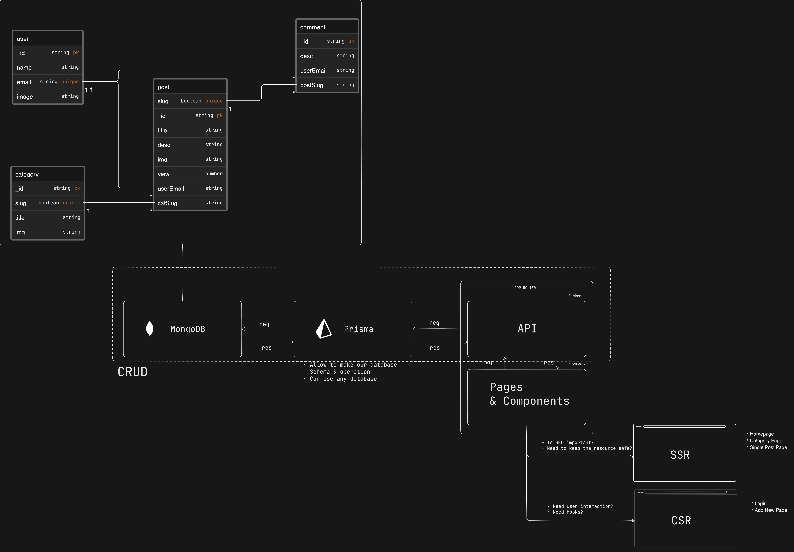
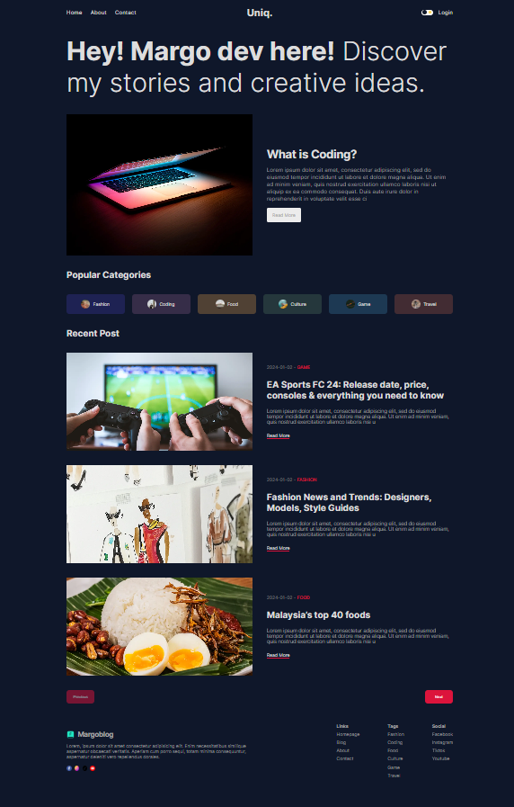
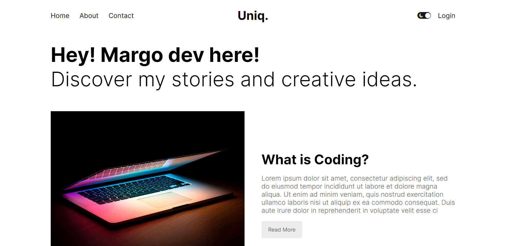
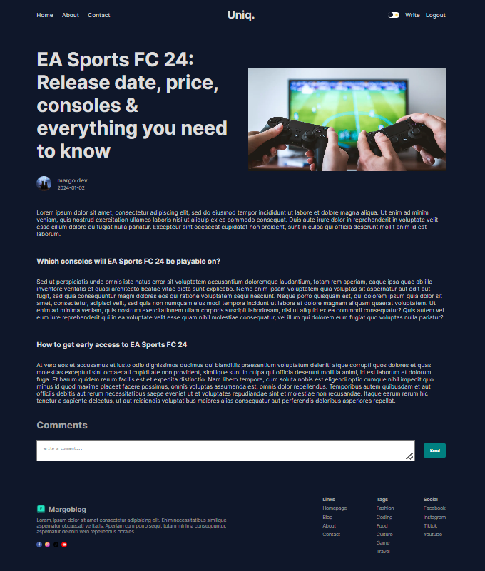
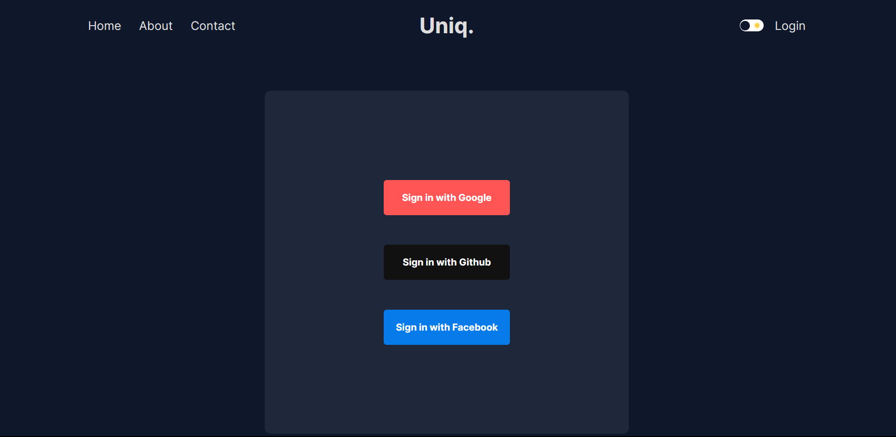
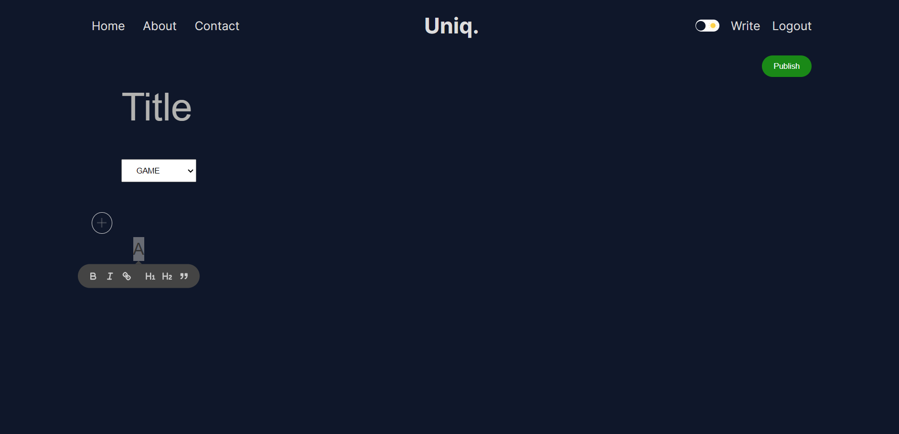
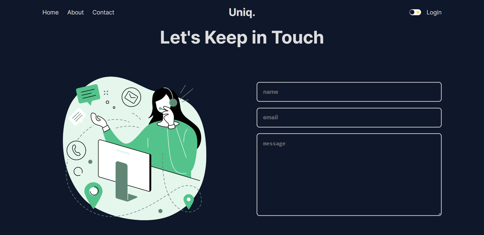

# Uniq. Blog Application
This is a next-blog app that allows users to create, and publish their own blog posts, as well comment on other posts. The blog app also features a responsive design, a user authentication system, and a rich text editor. This app is built with Next.js, CSS Module Stylesheet, JavaScript, and MongoDB. 

## Table of contents

- [Overview](#overview)
- [My Process](#my-process)
- [Features](#features)
- [Screenshot](#screenshot)
- [Links](#links)
- [Author](#author)

## Overview

## My process

This project uses the following technologies:

- [Next.js]: A React framework for building fast and scalable web applications. Also, use for data fetching and routing.
- [CSS Module Stylesheet]:  To make easier to use the same class name in different files without worrying about collisions.
- [JavaScript]: A well-known as the scripting language for Web pages.
- [MongoDB]: A document-based database that stores data in JSON-like format.
- [Auth.js]: A library for implementing authentication and authorization in Next.js apps.
- [Prisma]: An adapter to map the collections of data in MongoDB database
- [React Hook]: A library for building forms with React hooks.

## Features

- Create and publish blog posts
- Add image to your blog posts
- Comment on blog posts
- User authentication and authorization with Google, Facebook and GitHub
- Data fetching and storage with MongoDB and Prisma

### Framework

## Screenshot

### Homepage

### Homepage Light Mode

### Single Page Post

### Login Page

### Write New Post Page

### Contact Page

## Links

- Solution URL: [Solution](https://github.com/Atyn97/uniq-blog-app)
- Live Site URL: [Live site]()

## Author

- Fatin Nooraina - [@Atyn97](https://github.com/Atyn97)

